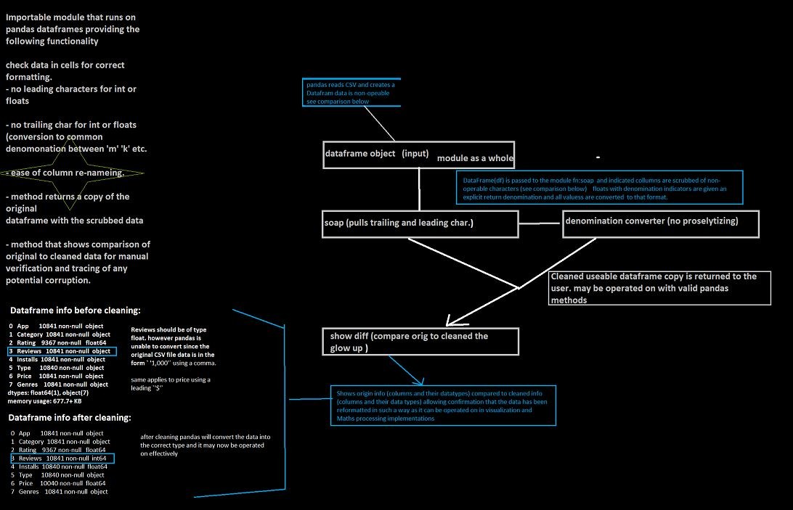
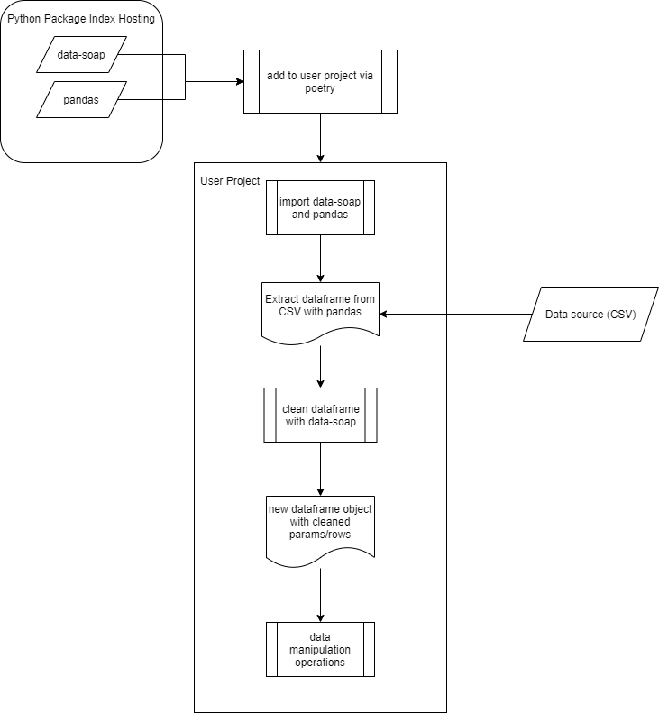

# DataSoap
**Author**: Jae Choi, Mason Fryberger, Alex Angelico, Grace Choi, Robert Carter  
**Version**: 1.0.0 
## MVP
CLI menu that allows users to request overall daily rating for group of websites, with other options for individual site readouts.

Stretch goals: 
-Regressive analysis on column sets to filter outliers 
_____
## User Stories
1. As a user, I want to create a pandas dataframe using a selected dataframe, in order to view and manipulate data.
Tasks:   
Pick a sample dataset that includes numbers  
Create a pandas dataframe  

2. As a user, I want to have a dataset with columns that host numbers in the same format, so that I can easily manipulate the data without running into data type issues.
Tasks:  
Check data in cells for formatting   
no leading characters for int or floats   
No trailing char for int or floats (conversion to common denomination between ‘m’, ‘k’, etc)  
Convert data to match and output a comparison (before and after cleanup)  

3. As a user, I want to create, package, and distribute the dataSoap module, in order to automate the cleaning CSV process.
Tasks:  
Create the project locally (file structure with folder > folder > file)  
Create the package files (License, Readme, Package, Toml, Tests, Metadata (setup.cfg, setup.py)  
Configure metadata (static or dynamic), Update ReadMe, Create license  
Generate distribution packages (installation via pip)  
Install new package  

4. As a user, I want to import the dataSoap module, in order to use it in conjunction with a pandas dataframe.
Tasks:  
Import dataSoap  
Make sure pandas dataframe object is a valid input for the dataSoap module  

5. As a user. I want to make sure I have the expected outputs for all methods and expected failures for edge cases, so that we can measure the project and usability. 
Tasks:  
Create user tests for expected outcomes  
Expected failures: non-int/floats  
Test for int/float conversion  
Test for int/float conversion that includes strings  
Make sure coverage tests are at least 80%  
_____
## Wireframes

_____
## Domain Model
 
_____

## Change Log
02-13-2021 4:35pm - Completed Project Prep 1-4 and updated ReadMe.  
02-15-2021 10:00pm - Completed basic Packaging, Readme (Project and Package), initial testing for functionality.  
02-16-2021 9:30pm - Finished dependency injection, tested package installation with dependencies, still working on functionality code, initial testing completed along with method completions.  
02-17-2021 9:30pm - Finished MVP methods, working on stretch goal methods for broader unit conversions, still testing main methods.  
02-18.2021 9:30pm - Finished all initial testing and got them to pass. Finished packaging updates.   
Blocker: module not found (installation works but module is not getting imported)  
02-20-2021 6pm - Coverage passing at 90-100%. Finished `convert_all` stretch goal. All current tests are passing. Repackaged module after setting up as Poetry project (toml changes instead of using setup.py).   
Blocker: unit conversion module not found (local module imported into source file)  
02-22-2021 9:30pm - Added more tests for class and tests are passing (coverage over 80%). Added more tests for stretch goal methods and all are currently passing. Started on documentation on readthedocs.org. Need to add more documentation for methods before updating again on readthedocs.org.  
